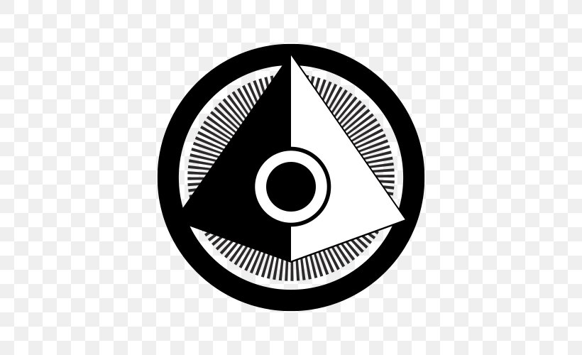
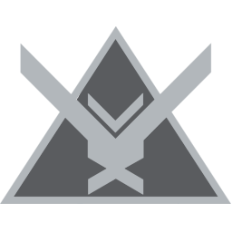

# ⚔️ Portafolio Halo - DaniiCam58

Bienvenido a mi portafolio inspirado en **Halo Infinite**.  
Este proyecto combina diseño, arte y programación en **HTML, CSS y JavaScript**, con un estilo visual que recuerda al universo Halo.  

---

## 🌐 Demo en vivo
🔗 [Visita mi portafolio aquí](https://daniicam58.github.io/WebHaloDani/)

---

## 📂 Secciones del proyecto
- 🏠 **Inicio** → [index.html](index.html)  
- 🎮 **Juego del Ahorcado** → [ahorcado.html](ahorcado.html)  
- 🧮 **Calculadora** → [calculadora.html](calculadora.html)  
- 📞 **Contáctanos** → [contactanos.html](contactanos.html)  
- 👤 **Sobre mí** → [sobre-mi.html](sobre-mi.html)  
- 🔑 **Login** → [login.html](login.html)  
- 🕹️ **Juego adicional** → [juego.html](juego.html)  

---

## 📸 Capturas de pantalla

### Pantalla principal

### Ícono Reach

---

## 🛠️ Tecnologías usadas
- **HTML5** → estructura del sitio  
- **CSS3** → estilos y diseño inspirado en Halo  
- **JavaScript** → lógica de juegos y formularios  

---

## ✒️ Autor
Desarrollado con dedicación por **DaniiCam58**  
